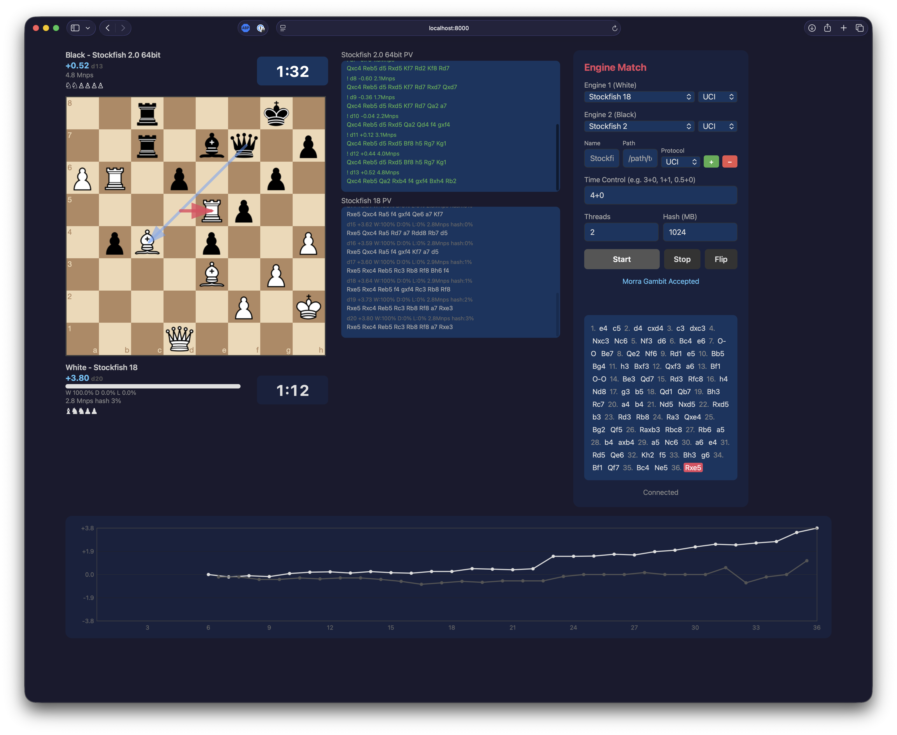

# Chess Engine Match

A real-time web-based chess engine match harness. Pit two engines against each other and watch them play with live evaluation, PV lines, WDL stats, and an eval chart.



## Features

- **Live board** with move arrows and piece animations
- **Streaming PV** and eval for both engines, updated each depth
- **WDL bar** and win/draw/loss percentages (UCI engines with WDL support)
- **Eval chart** tracking the advantage over the course of the game
- **Clock** with increment, ticking in real time
- **Move list** with click/keyboard navigation to review any position
- **Material shelf** showing captured pieces
- **Opening book** of sharp, balanced lines (Sicilian, Ruy Lopez, King's Indian, etc.)
- **UCI and CECP/XBoard** protocol support — use Stockfish, Crafty, or any compatible engine
- **Configurable** threads, hash, and time control per match

## Quick Start

```bash
pip install -r requirements.txt
python server.py
```

Open [http://localhost:8000](http://localhost:8000) in your browser.

## Adding Engines

Use the panel on the right to add engines by name and path. Select the protocol (UCI or CECP) for each engine. Engine configurations are saved in your browser's localStorage.

## Requirements

- Python 3.10+
- [python-chess](https://python-chess.readthedocs.io/)
- [FastAPI](https://fastapi.tiangolo.com/) + [Uvicorn](https://www.uvicorn.org/)
